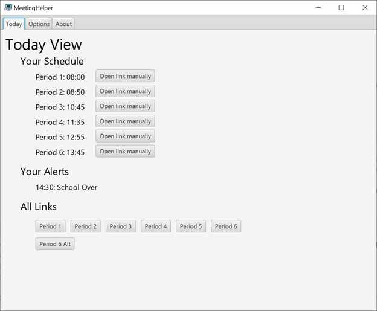
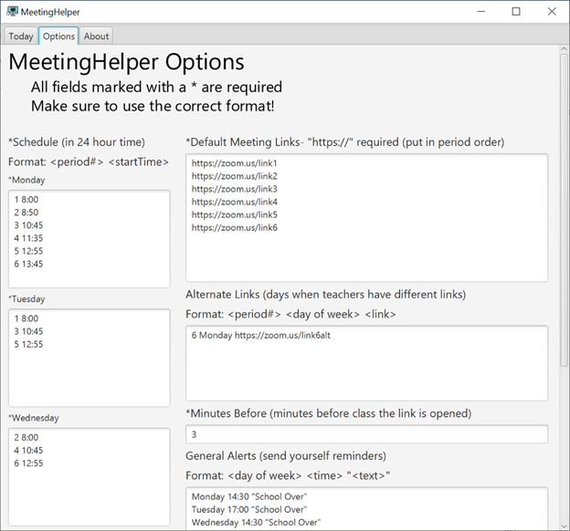
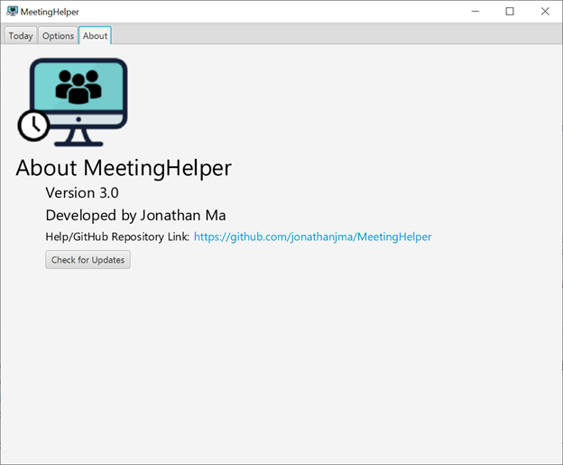
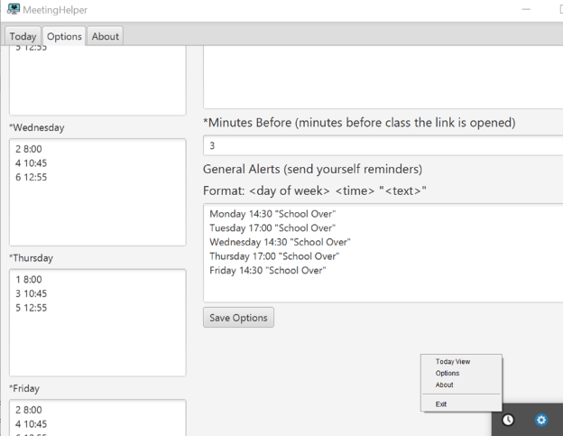

# Meeting Helper
Distance learning is new for everyone, and the last thing you want to happen is to miss class or be tardy.  
However, don't worry, that's why there's MeetingHelper.  
Based on your schedule, MeetingHelper will open your class meeting link in your browser automatically so that you don't have to!  
To get started, click the link below, download the latest version, and follow the setup instructions below.  
Download Link: https://github.com/jonathanjma/MeetingHelper/releases

## Features
+ Automatic meeting link opening (runs in background)
+ Today view to see your schedule and alerts for that day
+ Tray icon to open GUI/exit
+ Customizable Options:
    + Class Schedule
    + Class Meeting Links
    + Alternate Meeting Links (if a class has different links for different days)
    + How Early to Open Meeting Link
    + General Reminder Alerts
+ See [images](#images) below

## Setup Instructions
1. Download the MeetingHelper.zip file from the releases page (link above)
2. Locate the downloaded .zip file and extract all the files ("Extract All" button in file explorer)
2. Once extracted, run the MeetingHelper.exe file ([__java 8__](https://www.java.com/en/download/) is recommended to run)
    + If you get a warning from Windows that this is an unrecognized app, click "Run Anyways" (might be under "More Info")
    + A window should open with a default bell schedule and early open time
3. In the options window, set your options. The correct format for each option is below:
    + Schedule: \<period#> \<startTime> (ex. 1 8:00)
    + Links: put in period order, link must include "https://"
    + Alternate Links: \<period#> \<day of week> \<link> (ex. 6 Monday https://zoom.us/test)
    + Alerts: \<day of week> \<time> "\<alertText>" (ex. Friday 14:30 "School Over")
    + Make sure you are using 24-hour time
    + If you see any error notifications, make sure the format is correct
4. Make sure all fields marked with a * have been filled out
5. Click the "Save Options" button (might have to scroll down)
6. If you click on the "Today" tab, you should see your schedule and alerts for today
    + You can also manually open meeting links by clicking the buttons below the "All Links" header or by clicking the button next to each period
7. That's it!
    + To open or exit the app, just click the tray icon (clock icon) 
    at the bottom right of your screen next to the system icons (battery, Wi-Fi, etc).
    + Enjoy :-)

## Version History

#### v3.0
+ Added today and about view
+ Can manually open meeting links
+ Can check for updates
+ Reduced memory usage

#### v2.0
+ GUI to change options
+ Can use custom schedule
+ Can change how early to open meeting links
+ Added support for alternate links
+ Added support for reminder alerts

#### v1.0
+ Meeting links automatically opened
+ Notifications when meeting links opened
+ Follows Mission San Jose HS bell schedule
+ Set meeting links in text file
+ Tray Icon

## Images

